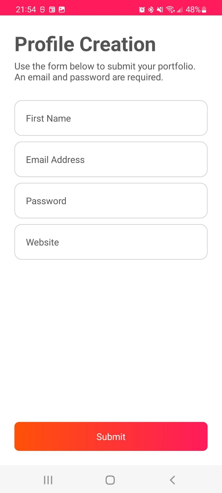
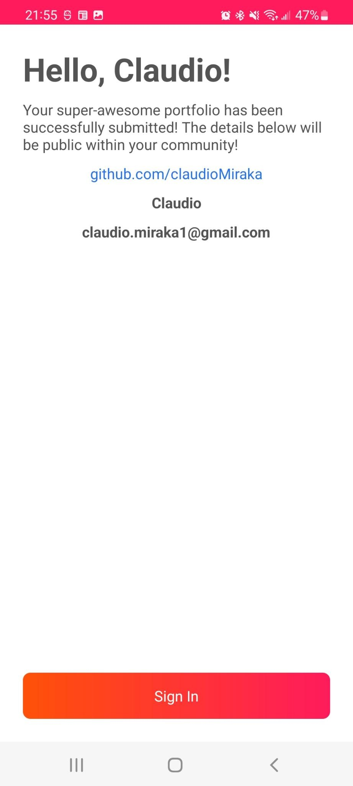
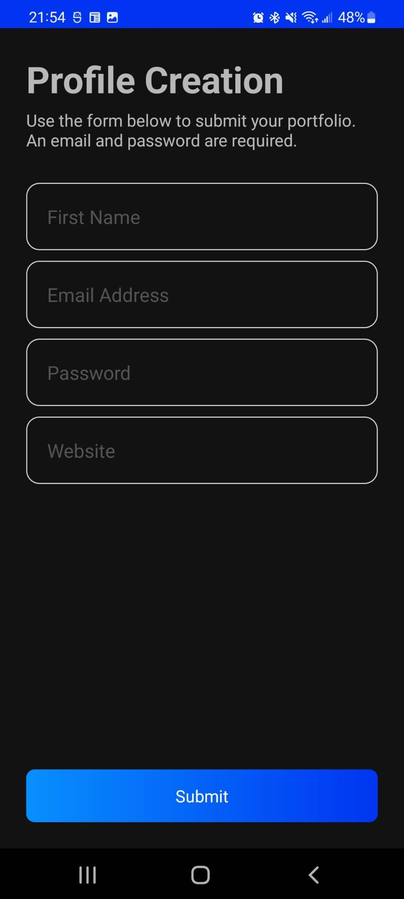

# SignUpProject
A simple sign up page. 

## Description
A simple SignUp page followed by another page showing the user its own input.
A valid form require the email to be valid and the password to be at leasst 6 chars long.

The architecture patter used is MVVM.
Data Binding and Live Data Libraries are used to communicate between Views and ViewModel.
Hilt is used as a depency injector. 

Since the form is not submitted to a real service, no persistance is implemented. The user data lives in memory in a UserRepository object.

## Screenshots

  
  

  
  

